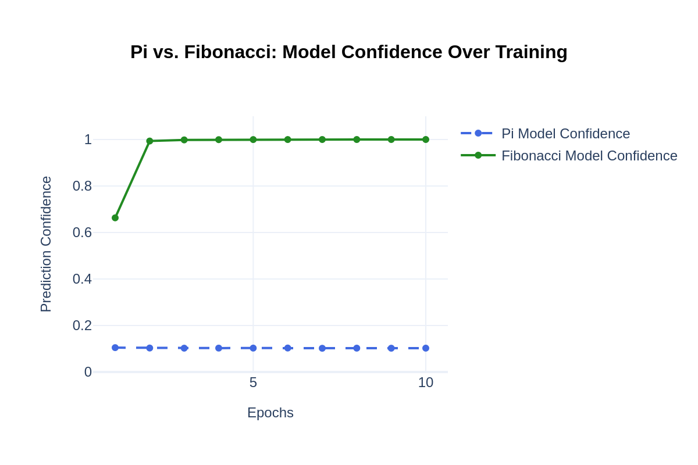

# Pi vs. AI: Could a Neural Network Predict the Next Digit of Pi?  

## Introduction 
This project explores whether AI can predict the next digit of Pi using a **Long Short-Term Memory (LSTM) neural network**. Since Pi is irrational and non-repeating, the experiment tests whether AI can detect a pattern.  

To validate the model’s ability to learn sequences, we also trained it on Fibonacci numbers, which follow a strict mathematical rule.  

## Dataset  

🔹 **Pi Dataset:**  
- We used the first **100,000 digits of Pi**, available [here](https://www.angio.net/pi/digits/100000.txt).  

🔹 **Fibonacci Dataset:**  
- Fibonacci numbers were generated dynamically.  
- Only the **last digit (MOD 10)** was used, revealing a **60-digit repeating cycle (Pisano Period 10).**  

## Models Trained  

We trained two **LSTM neural network models**:  

**Pi Model**: Trained on Pi’s digits to predict the next digit.  
**Fibonacci Model**: Trained on Fibonacci’s digits to predict the next digit.  

Both models used sequence-based learning, where AI was fed previous digits and asked to predict the next one.  

## Results  

📉 **Pi Model Accuracy**: ~10% (same as random guessing)  
📈 **Fibonacci Model Accuracy**: ~100% (AI learned the repeating cycle)  

AI could not learn Pi → Pi has no discoverable pattern.  
AI quickly learned Fibonacci → Fibonacci follows a predictable structure.  

### Accuracy Comparison & Confidence Over Training
<div align="center">
  
  
</div>

## Installation & Running the Code  

### Prerequisites  
Ensure you have **Python 3.8+** and the following libraries installed:  
```bash
pip install numpy pandas torch plotly matplotlib jupyter
```

Clone the Repository
```bash
git clone https://github.com/manishacharya60/pi_digits_prediction.git
cd pi_digits_prediction
```
Launch Jupyter Notebook
```bash
jupyter notebook
```
### Open and Run the Notebooks
- **Pi Model:** [`Pi_Digits_Prediction.ipynb`](Pi_Digits_Prediction.ipynb)  
- **Fibonacci Model:** [`Fibonacci_Digits_Prediction.ipynb`](Fibonacci_Digits_Prediction.ipynb)  
- **Compare Results:** [`Compare_pi_vs_fibonacci.ipynb`](Compare_pi_vs_fibonacci.ipynb)

## Conclusion  

AI is powerful—but only when a pattern exists!  
- AI could not predict Pi, confirming that **Pi is truly random**.  
- AI quickly mastered Fibonacci, proving it **excels at structured sequences**.  

This experiment highlights the limits of AI—it can’t predict what isn’t predictable.  

For a deeper dive into this project, check out the **[blog post (link coming soon!)]()**.  
